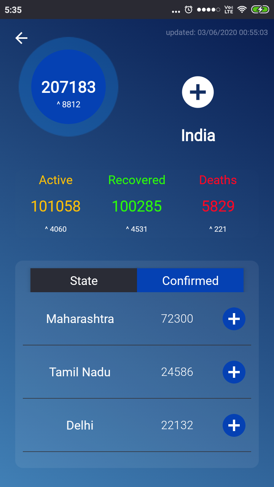
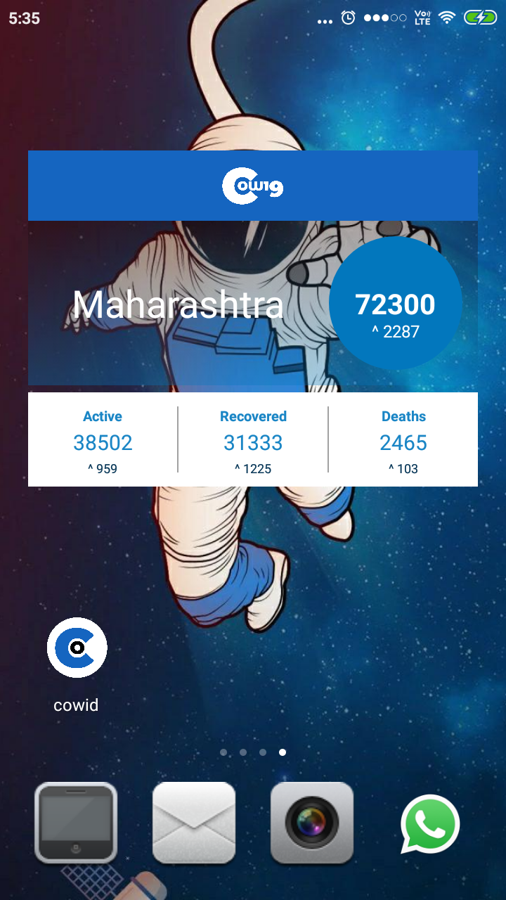
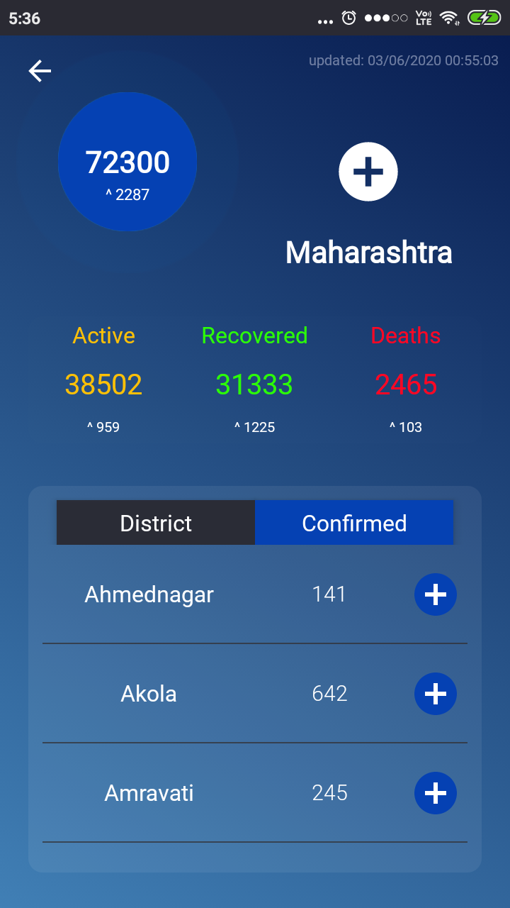

# cowid
COVID19' India cases tracker Home Screen widget for android devices. Developed to update the real-time cases confirmed, active, recovered and deceased
and daily changes in them at country, state and district level where the user can easily customize the widget according to the state,district he/she wants to track.

The Data is fetched and based on the repository maintained for the **API** 
**<a href="https://api.covid19india.org/">api.covid19india.org</a>**

Application Download Link
**<a href="https://drive.google.com/file/d/1f_zyjpWqIQ7M8X_-tQaIoAuVjVYYVZYi/view?usp=sharing">cowid.apk</a>**
 
